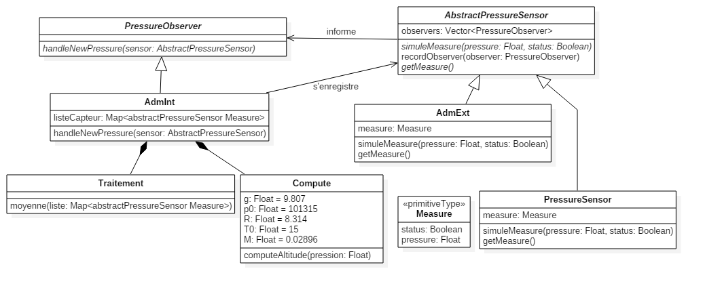

# CS 515 - TP2 : Pattern Listener

Développement d'un ADM (Air Data Module) simplifié qui calcule une altitude et son statut à partir de mesures de pression atmosphérique.

## Diagramme UML



On retrouve bien notre **pattern listener** entre les objets *PressureObserver*, *AdmInt*, *AbstractPressureSensor*.

## Code source

### Type Mesure

C'est le type qui va contenir les mesures des différents capteurs.

```Ada
package Measure is

   type T_Measure is record 
      status: Boolean;
      pressure: Float;
   end record;

end measure;
```

> measure.ads

### AbstractPressureSensor

Abstraction permettant de regrouper tout les capteurs.

On notera que cet objet permet de retenir une liste d'*observer*, qu'il faut notifier lorsque la valeur du capteur change.

```Ada
with PressureObserver; use PressureObserver;
with Ada.Containers.Vectors; use Ada.Containers;
with Measure; use Measure;

package AbstractPressureSensor is
   
   package ObserverContainer is new Vectors (Natural, T_PressureObserver_Access);
   
   type T_AbstractPressureSensor is abstract tagged record
      observers: ObserverContainer.Vector;
   end record;
   type T_AbstractPressureSensor_Access is access all T_AbstractPressureSensor'Class;
   
   procedure simuleMeasure(this: access T_AbstractPressureSensor; 
                           pressure: in Float;
                           status: in Boolean) is abstract;
   procedure recordObserver(this: access T_AbstractPressureSensor;
                            observer: access T_PressureObserver'Class);
   function getMeasure(this: access T_AbstractPressureSensor) return T_Measure is abstract;
   
end AbstractPressureSensor;
```

> abstractpressuresensor.ads

```Ada
package body AbstractPressureSensor is

   procedure recordObserver
     (this: access T_AbstractPressureSensor;
      observer: access T_PressureObserver'Class)
   is
   begin
      this.observers.Append(observer);
      observer.handleNewPressure(this);
   end recordObserver;

end AbstractPressureSensor;
```

> abstractpressuresensor.adb

### AdmExt et PressureSensor

Dans le cadre de cet exercice les deux implémentations sont très similaires et permettent simplement de simuler une nouvelle valeur.

```Ada
with AbstractPressureSensor; use AbstractPressureSensor;
with PressureObserver; use PressureObserver;
with Measure; use Measure;

package AdmExt is

   type T_AdmExt is new T_AbstractPressureSensor with private;
   type T_AdmExt_Access is access all T_AdmExt'Class;
   
   package Constructor is
      function Initialize(status: in Boolean; 
                          pressure: in Float) 
                          return T_AdmExt_Access;
   end;
     
   overriding procedure simuleMeasure(this: access T_AdmExt; 
                                      pressure: in Float; 
                                      status: in Boolean);
   
   overriding function getMeasure(this: access T_AdmExt) return T_Measure;
   
private
   type T_AdmExt is new T_AbstractPressureSensor with record
      measure: T_Measure;
   end record;
   
end AdmExt;
```

> admext.ads

```Ada
with AbstractPressureSensor; use AbstractPressureSensor.ObserverContainer;
with PressureObserver; use PressureObserver;

package body AdmExt is

   package body Constructor is
      function Initialize (status: in Boolean; pressure: in Float)
         return T_AdmExt_Access
      is
         Temp_Ptr : T_AdmExt_Access;
      begin
         Temp_Ptr := new T_AdmExt;
         Temp_Ptr.measure.status := status;
         Temp_Ptr.measure.pressure := pressure;
         return Temp_Ptr;
      end Initialize;
   end Constructor;

   overriding procedure simuleMeasure (this: access T_AdmExt;
                                       pressure: in Float;
                                       status: in Boolean)
   is
      C: Cursor := this.observers.First;
   begin
      this.measure.pressure := pressure;
      this.measure.status := status;
      loop
         exit when C = No_Element;
         Element(C).handleNewPressure(T_AbstractPressureSensor_Access(this));
         ObserverContainer.Next(C);
      end loop;
   end simuleMeasure;

   overriding function getMeasure(this: access T_AdmExt) return T_Measure
   is
   begin
      return this.measure;
   end getMeasure;

end AdmExt;
```

> admext.adb

```Ada
with AbstractPressureSensor; use AbstractPressureSensor;
with PressureObserver; use PressureObserver;
with Measure; use Measure;

package PressureSensor is

   type T_PressureSensor is new T_AbstractPressureSensor with private;
   type T_PressureSensor_Access is access all T_PressureSensor'Class;
   
   package Constructor is
      function Initialize(status: in Boolean; 
                          pressure: in Float) return T_PressureSensor_Access;
   end;
      
   overriding procedure simuleMeasure(this: access T_PressureSensor; 
                                      pressure: in Float; 
                                      status: in Boolean);
   overriding function getMeasure(this: access T_PressureSensor) return T_Measure;
   
private
   type T_PressureSensor is new T_AbstractPressureSensor with record
      measure: T_Measure;
   end record;
   
end PressureSensor;
```

> pressuresensor.ads

```Ada
with AbstractPressureSensor; use AbstractPressureSensor.ObserverContainer;
with PressureObserver; use PressureObserver;

package body PressureSensor is

   package body Constructor is
      function Initialize (status: in Boolean; pressure: in Float)
         return T_PressureSensor_Access
      is
         Temp_Ptr : T_PressureSensor_Access;
      begin
         Temp_Ptr := new T_PressureSensor;
         Temp_Ptr.measure.status := status;
         Temp_Ptr.measure.pressure := pressure;
         return Temp_Ptr;
      end Initialize;
   end Constructor;

   overriding procedure simuleMeasure
     (this: access T_PressureSensor;
      pressure: in Float;
      status: in Boolean)
   is
      C: Cursor := this.observers.First;
   begin
      this.measure.pressure := pressure;
      this.measure.status := status;
      loop
         exit when C = No_Element;
         Element(C).handleNewPressure(T_AbstractPressureSensor_Access(this));
         ObserverContainer.Next(C);
      end loop;
   end simuleMeasure;

   overriding function getMeasure(this: access T_PressureSensor) return T_Measure
   is
   begin
      return this.measure;
   end getMeasure;

end PressureSensor;
```

> pressuresensor.adb

### PressureObserver

C'est l'abstraction permettant d'être notifié en cas de changement de valeur sur l'un des capteurs.

On peut remarquer que l'on identifie les capteurs par leur adresse puisque c'est la seule information qu'on passe à cette méthode.

```Ada
limited with AbstractPressureSensor;

package PressureObserver is
   type T_PressureObserver is abstract tagged null record;
   type T_PressureObserver_Access is access all T_PressureObserver'Class;

   procedure handleNewPressure(this: access T_PressureObserver; 
                               sensor: access AbstractPressureSensor.T_AbstractPressureSensor'Class
                              ) is abstract;

end PressureObserver;
```

> pressureobserver.ads

### AdmInt

Implémente l'objet en charge de récupèrer les données des différents capteur et de fournir la valeur de l'altitude en temps réel.

Nous stockons les différents pressions dans une **Hashed_Map** ayant comme clé l'adresse de l'objet *Capteur de pression*, et comme valeur une *Measure*.

A l'initialisation, il doit s'enregistrer auprès des différents capteurs qu'il veut observer.

Ensuite à la notification d'une nouvelle valeur, *AdmInt* va :

1. Enregistrer la valeur dans la Hashmap
2. Passer la liste de valeur au module *Traitement* qui lui retourne la moyenne de toutes les pressions
3. Si la pression est correcte, il demande le calcul de l'altitude au module *Compute* et affiche l'altitude retournée ; Sinon il retourne que l'altitude n'est pas disponible.

```Ada
with PressureObserver; use PressureObserver;
with Ada.Containers.Hashed_Maps; use Ada.Containers;
with Measure; use Measure;
with AbstractPressureSensor; use AbstractPressureSensor;

package AdmInt is
   type T_AdmInt is new T_PressureObserver with private;
   type T_AdmInt_Access is access all T_AdmInt'Class;
   
   overriding procedure handleNewPressure(this: access T_AdmInt; 
                                          sensor: access T_AbstractPressureSensor'Class
                                         );
   
   function ID_Hashed (id: T_AbstractPressureSensor_Access) return Hash_Type;

   package SensorMap is new Ada.Containers.Hashed_Maps
     (Key_Type => T_AbstractPressureSensor_Access,
      Element_Type => T_Measure,
      Hash => ID_Hashed,
      Equivalent_Keys => "=");
   
private
   type T_AdmInt is new T_PressureObserver with record
      listeCapteur: SensorMap.Map;
   end record;

end AdmInt;
```

> admint.ads

```Ada
with AdmInt; use AdmInt.SensorMap;
with System; use System;
with Compute; use Compute;
with Traitement; use Traitement;
with Ada.Text_IO; use Ada.Text_IO;
with System.Address_To_Access_Conversions;
with Ada.Strings;
with System.Address_Image;
with Ada.Strings.Hash;

package body AdmInt is

   overriding procedure handleNewPressure
     (this: access T_AdmInt;
      sensor: access T_AbstractPressureSensor'Class)
   is
      resultat: T_Measure;
   begin
      if this.listeCapteur.Find(sensor) = No_Element
      	then this.listeCapteur.Insert(sensor, sensor.getMeasure);
      	else this.listeCapteur.Replace(sensor, sensor.getMeasure);
      end if;
      resultat := Moyenne(this.listeCapteur);
      if resultat.status
      then
         Put_Line("Altitude : " & Float'image(computeAltitude(resultat.pressure)));
      else
         Put_Line("Altitude : KO");
      end if;

   end handleNewPressure;

   function ID_Hashed
     (id: T_AbstractPressureSensor_Access)
      return Hash_Type
   is
   begin
      return Ada.Strings.Hash(System.Address_Image(id.all'Address));
   end ID_Hashed;

end AdmInt;
```

> admint.adb

### Traitement

Permet de traiter une liste de pression en vérifiant leur validité puis en calculant la moyenne de toutes ces pressions valide.

Remarque : Il s'agit uniquement d'un package et pas d'un objet. Cela permet de séparer les rôles, cependant si on veux changer de fonction *Moyenne* il faut le faire en recompilant et non à la volée comme on pourrait le faire avec un objet lié à *AdmInt*.

```Ada
with AdmInt;
with Measure;
with Compute;

package Traitement is
   
   function Moyenne(liste: in AdmInt.SensorMap.Map) 
                    return Measure.T_Measure
     with post => (Moyenne'Result.status and Moyenne'Result.pressure <= Compute.p0 and Moyenne'Result.pressure > 0.0) or 
     			(not Moyenne'Result.status and Moyenne'Result.pressure = 0.0);
   
end Traitement;
```

> traitement.ads

Nous avons ajouté des postconditions qui sont directement liées aux éxigences concernant ce qui est retourné.

```Ada
with AdmInt; use AdmInt.SensorMap;
with Compute; use Compute;
with Measure; use Measure;

package body Traitement is

   function Moyenne(liste: in AdmInt.SensorMap.Map) 
                    return T_Measure 
   is
      item : Cursor := liste.First;
      compteur : Natural := 0;
      somme : Float := 0.0;
      resultat : T_Measure;
   begin
      loop
         exit when item = No_Element;
         if Element(item).status and 
           Element(item).pressure>0.0 and 
           Element(item).pressure <= Compute.p0
         then 
            compteur := compteur + 1;
            somme := somme + Element(item).pressure;
         end if;
         Next(item);
      end loop;
                  
      resultat.status := compteur/=0;
      if compteur /= 0
      then resultat.pressure := somme/Float(compteur);
      end if;
      
      return resultat;
   end Moyenne;

end Traitement;
```

> traitement.adb

### Compute

Ce package contient une procèdure qui retourne l'altitude à partir d'une pression, en définissant diverse constante.

Remarque : Il s'agit uniquement d'un package et pas d'un objet. Cela permet de séparer les rôles, cependant si on veux changer de fonction *computeAltitude* il faut le faire en recompilant et non à la volée comme on pourrait le faire avec un objet lié à *AdmInt*.

```Ada
package Compute is
   
   function computeAltitude(pression: in Float) return Float
     with pre => pression > 0.0 and pression <= p0,
     post => computeAltitude'Result >= 0.0;
   
   g : constant Float := 9.807;
   p0 : constant Float := 101315.0;
   R : constant Float := 8.314;
   T0 : constant Natural := 15;
   M : constant Float := 0.02896;
   
end Compute;
```

> compute.ads

Nous avons mis en place de la **programmation par contrat** avec une précondition concernant la pression et une postcondition concernant le l'altitude retournée par cette fonction.

```Ada
with Ada.Numerics.Generic_Elementary_Functions;

package body Compute is

   function computeAltitude (pression: in Float) return Float is
      package Math is new Ada.Numerics.Generic_Elementary_Functions(Float);
   begin
      return R*Float(T0)*Math.Log(p0/pression)/(M*g);
   end computeAltitude;

end Compute;
```

> compute.adb

## Tests

### Fichier de test

 ```Ada
with AbstractPressureSensor; use AbstractPressureSensor;
with PressureSensor; use PressureSensor;
with AdmExt; use AdmExt;
With Ada.Text_IO; use Ada.Text_IO;
with AdmInt; use AdmInt;
with PressureObserver; use PressureObserver;

procedure Main is
   sensor1: T_AbstractPressureSensor_Access;
   sensor2: T_AbstractPressureSensor_Access;

   adm1: T_AdmInt_Access;
begin
   put_line("----- Init -----");
   sensor1 := T_AbstractPressureSensor_Access(PressureSensor.Constructor.Initialize(true, 42.42));
   sensor2 := T_AbstractPressureSensor_Access(AdmExt.Constructor.Initialize(true, 79.2));
   adm1 := new T_AdmInt;

   put_line("Test 1 avec 1 sensor (OK, 42.42)");
   sensor1.recordObserver(T_PressureObserver_Access(adm1));

   put_line("Test 2 avec 1 sensor (OK, 80.4)");
   sensor1.simuleMeasure(80.4, true);

   put_line("Test 3 avec 1 sensor (KO, 80.4)");
   sensor1.simuleMeasure(80.4, false);

   Put_Line("Test 4 avec 2 sensors (KO, 80.4) (OK, 79.2)");
   sensor2.recordObserver(T_PressureObserver_Access(adm1));

   Put_Line("Test 5 avec 2 sensors (OK, 80.4) (OK, 79.2)");
   sensor1.simuleMeasure(80.4, true);

   Put_Line("Test 6 avec 2 sensors (OK, -42) (OK, 79.2)");
   sensor1.simuleMeasure(-42.0, true);

   Put_Line("Test 7 avec 2 sensors (OK, -42) (OK, 9999999)");
   sensor2.simuleMeasure(9999999.0, true);

end Main;
 ```

### Exécution des tests

```Ada
----- Init -----
Test 1 avec 1 sensor (OK, 42.42)
Altitude :  3.41551E+03
Test 2 avec 1 sensor (OK, 80.4)
Altitude :  3.13475E+03
Test 3 avec 1 sensor (KO, 80.4)
Altitude : KO
Test 4 avec 2 sensors (KO, 80.4) (OK, 79.2)
Altitude :  3.14135E+03
Test 5 avec 2 sensors (OK, 80.4) (OK, 79.2)
Altitude :  3.13804E+03
Test 6 avec 2 sensors (OK, -42) (OK, 79.2)
Altitude :  3.14135E+03
Test 7 avec 2 sensors (OK, -42) (OK, 9999999)
Altitude : KO
[2017-11-09 16:40:26] process terminated successfully, elapsed time: 00.99s
```

### Analyse

### Test 1 

- Ce test montre que l’ajout d’un nouveau capteur de pression déclenche le calcul de l’altitude.
- On voit aussi que la valeur retournée est correct, cela confirme l’exigence No 5.

### Test 2 

- Lors de l’appel à "simulMeasure()" sur le capteur avec une pression OK valide, on observe que le calcul de l’altitude se déclenche automatiquement. Cela valide l’exigence No 1.
- On voit aussi que la valeur retournée est correct, cela confirme l’exigence No 5.

### Test 3 

- On utilise encore "simulMeasure()" pour un statut KO, on observe que l’Adm recalcule une valeur KO lui aussi.
- Cela confirme en partie l’exigence No 4 (voir test 7).

### Test 4 

- Toujours avec le capteur KO, on ajoute un nouveau capteur OK avec une valeur valide, on observe que l’Adm passe immédiatement à l’état OK et retourne une altitude valide en fonction de la pression retourné par le deuxième capteur.

### Test 5 

- L’état du premier capteur redevient OK et les valeurs des capteur sont tous les deux valides. On observe une valeur d’altitude correcte en fonction d’une pression équivalente à la moyenne des pressions des capteurs. Cela confirme l’exigence No 3.

### Test 6

- L’état du premier capteur reste OK mais sa valeur est négative, ce qui est invalide. On observe que l’Adm se met à jour uniquement avec la pression du deuxième capteur et on obtient la même altitude qu’au test 4, le capteur 1 est bien ignoré par l’Adm. Cela confirme l’exigence No 2.

### Test 7 

- Au tour du deuxième capteur de donner une valeur invalide avec un statut OK, cette fois ci la valeur est supérieur à p0, on observe que l’Adm retourne bien le statut KO, l’exigence No 4 est confirmée.

Toutes les exigences sont bien vérifiées et le programme semble bien fonctionner.


