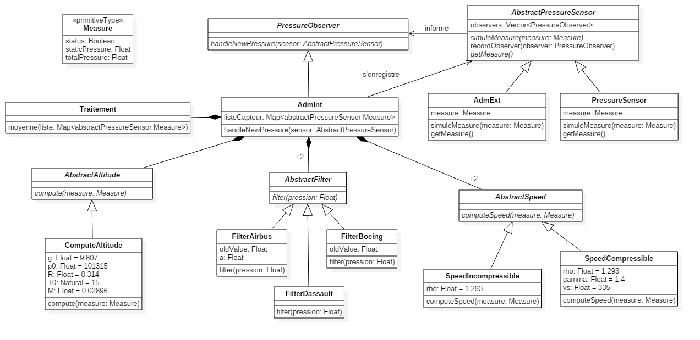

# CS 515 - TP3 : Pattern Stratégie

Développement d'un ADM (Air Data Module) simplifié qui calcule l'altitude et la vitesse son statut à partir de mesures de pression atmosphérique statique et dynamique.

## Diagramme UML



On retrouve la structure générale mise en place au TP précédent, avec le **pattern listener** permettant à un *AdmInt* de s'abonner à un *PressureSensor*. Maintenant, comme l'*AdmInt* peut avoir plusieurs stratégie pour le filtre ou le calcul de la vitesse, on utilise le **pattern strategy**. Ainsi peut importe l'objet utilisé pour filtrer ou pour calculer la vitesse, l'*AdmInt* ne verra que l'abstraction associée. On peut définir cet objet à la construction, et le changer en cours d'exécution.

## Code source

### Type Mesure

C'est le type qui va contenir les mesures des différents capteurs : le status, les pressions statique et totale.

```Ada
package Measure is

   type T_Measure is record 
      status: Boolean;
      totalPressure: Float;
      staticPressure: Float;
   end record;

end measure;
```

> measure.ads

### AbstractPressureSensor

Abstraction permettant de regrouper tout les capteurs.

On notera que cet objet permet de retenir une liste d'*observer*, qu'il faut notifier lorsque la valeur du capteur change.

```Ada
with PressureObserver; use PressureObserver;
with Ada.Containers.Vectors; use Ada.Containers;
with Measure; use Measure;

package AbstractPressureSensor is
   
   package ObserverContainer is new Vectors (Natural, T_PressureObserver_Access);
   
   type T_AbstractPressureSensor is abstract tagged record
      observers: ObserverContainer.Vector;
   end record;
   type T_AbstractPressureSensor_Access is access all T_AbstractPressureSensor'Class;
   
   procedure simuleMeasure(this: access T_AbstractPressureSensor; 
                           measure: in T_Measure) is abstract;

   procedure recordObserver(this: access T_AbstractPressureSensor;
                            observer: access T_PressureObserver'Class);
   
   function getMeasure(this: access T_AbstractPressureSensor) return T_Measure is abstract;

end AbstractPressureSensor;
```

> abstractpressuresensor.ads

```Ada
package body AbstractPressureSensor is

   procedure recordObserver
     (this: access T_AbstractPressureSensor;
      observer: access T_PressureObserver'Class)
   is
   begin
      this.observers.Append(observer);
   end recordObserver;

end AbstractPressureSensor;
```

> abstractpressuresensor.adb

### AdmExt et PressureSensor

Dans le cadre de cet exercice les deux implémentations sont très similaires et permettent simplement de simuler une nouvelle valeur.

```Ada
with AbstractPressureSensor; use AbstractPressureSensor;
with PressureObserver; use PressureObserver;
with Measure; use Measure;

package AdmExt is

   type T_AdmExt is new T_AbstractPressureSensor with private;
   type T_AdmExt_Access is access all T_AdmExt'Class;
     
   overriding procedure simuleMeasure(this: access T_AdmExt; 
                                      measure: in T_Measure);

   overriding function getMeasure(this: access T_AdmExt) return T_Measure;
   
private
   type T_AdmExt is new T_AbstractPressureSensor with record
      measure: T_Measure;
   end record;
   
end AdmExt;
```

> admext.ads

```Ada
with AbstractPressureSensor; use AbstractPressureSensor.ObserverContainer;
with PressureObserver; use PressureObserver;

package body AdmExt is

   overriding procedure simuleMeasure(this: access T_AdmExt;
                                      measure: in T_Measure)
   is
      C: Cursor := this.observers.First;
   begin
      this.measure := measure;
      loop
         exit when C = No_Element;
         Element(C).handleNewPressure(T_AbstractPressureSensor_Access(this));
         ObserverContainer.Next(C);
      end loop;
   end simuleMeasure;

   overriding function getMeasure(this: access T_AdmExt) return T_Measure
   is
   begin
      return this.measure;
   end getMeasure;

end AdmExt;
```

> admext.adb

```Ada
with AbstractPressureSensor; use AbstractPressureSensor;
with PressureObserver; use PressureObserver;
with Measure; use Measure;

package PressureSensor is

   type T_PressureSensor is new T_AbstractPressureSensor with private;
   type T_PressureSensor_Access is access all T_PressureSensor'Class;
      
   overriding procedure simuleMeasure(this: access T_PressureSensor; 
                                      measure: in T_Measure);
   overriding function getMeasure(this: access T_PressureSensor) return T_Measure;
   
private
   type T_PressureSensor is new T_AbstractPressureSensor with record
      measure: T_Measure;
   end record;
   
end PressureSensor;

```

> pressuresensor.ads

```Ada
with AbstractPressureSensor; use AbstractPressureSensor.ObserverContainer;
with PressureObserver; use PressureObserver;

package body PressureSensor is

   overriding procedure simuleMeasure(this: access T_PressureSensor;
                                      measure: in T_Measure)
   is
      C: Cursor := this.observers.First;
   begin
      this.measure := measure;
      loop
         exit when C = No_Element;
         Element(C).handleNewPressure(T_AbstractPressureSensor_Access(this));
         ObserverContainer.Next(C);
      end loop;
   end simuleMeasure;

   overriding function getMeasure(this: access T_PressureSensor) return T_Measure
   is
   begin
      return this.measure;
   end getMeasure;

end PressureSensor;

```

> pressuresensor.adb

### PressureObserver

C'est l'abstraction permettant d'être notifié en cas de changement de valeur sur l'un des capteurs.

On peut remarquer que l'on identifie les capteurs par leur adresse puisque c'est la seule information qu'on passe à cette méthode.

```Ada
limited with AbstractPressureSensor;

package PressureObserver is
   type T_PressureObserver is abstract tagged null record;
   type T_PressureObserver_Access is access all T_PressureObserver'Class;

   procedure handleNewPressure(this: access T_PressureObserver; 
                               sensor: access AbstractPressureSensor.T_AbstractPressureSensor'Class
                              ) is abstract;

end PressureObserver;
```

> pressureobserver.ads

### Stratégie des filtres

####AbstractFilter

C'est la première apparition du partern stratégie. Il permet de regrouper les différents types de filtres (tout les filtres doivent implémenter la fonction *filtrer*).

```Ada
package AbstractFilter is

   type T_AbstractFilter is abstract tagged null record;
   type T_AbstractFilter_Access is access all T_AbstractFilter'Class;
   
   function filter(this: access T_AbstractFilter;
                   pressure: in Float) return Float is abstract;
   
end AbstractFilter;
```

> abstractfiltrer.ads

#### FilterAirbus

Filtre pour les avions Airbus. On prend lors de la construction la constante **a** qui vaut 0.1 ou 0.01 en fonction de la pression filtrée. Il faut aussi garder en mémoire la dernière pression calculée.

```Ada
with AbstractFilter; use AbstractFilter;

package FilterAirbus is
   
   type T_FilterAirbus is new T_AbstractFilter with private;
   type T_FilterAirbus_Access is access all T_FilterAirbus'Class;
   
   package Constructor is
      function Initialize(a: in Float) return T_FilterAirbus_Access;
   end;
   
   overriding function filter(this: access T_FilterAirbus;
                   pressure: in Float) return Float;
   
   private
   type T_FilterAirbus is new T_AbstractFilter with record
      oldValue: Float := -42.0;
      a: Float;
   end record;

end filterAirbus;
```

> filterAirbus.ads

```Ada
package body FilterAirbus is

   package body Constructor is
      function Initialize (a: in Float) return T_FilterAirbus_Access
      is
         Temp_Ptr : T_FilterAirbus_Access;
      begin
         Temp_Ptr := new T_FilterAirbus;
         Temp_Ptr.a := a;
         return Temp_Ptr;
      end Initialize;
   end Constructor;

   function filter (this: access T_FilterAirbus; pressure: in Float)
      return Float
   is
   begin
      if this.oldValue < 0.0
      then
         this.oldValue := pressure;
      else
         this.oldValue := pressure + this.a * this.oldValue;
      end if;
      return this.oldValue;

   end filter;

end FilterAirbus;
```

> filterAirbus.adb

#### FilterBoeing

Il faut garder en mémoire la dernière pression reçue.

```
with AbstractFilter; use AbstractFilter;

package filterBoeing is
   
   type T_FilterBoeing is new T_AbstractFilter with private;
   type T_FilterBoeing_Access is access all T_FilterBoeing'Class;
   
   overriding function filter(this: access T_FilterBoeing;
                   pressure: in Float) return Float;
   
private
   type T_FilterBoeing is new T_AbstractFilter with record
      oldValue: Float := -42.0;
   end record;

end filterBoeing;
```

> filterboeing.ads

```Ada
with Ada.Text_IO; use Ada.Text_IO;

package body filterBoeing is

   function filter
     (this: access T_FilterBoeing;
      pressure: in Float)
      return Float
   is
      result: Float;
   begin
      if this.oldValue < 0.0
      then
         result := pressure;
      else
         result := (pressure + this.oldValue)/2.0;
      end if;
      this.oldValue := pressure;
      return result;

   end filter;

end filterBoeing;
```

> filterboeing.adb

#### FilterDassault

Rien de spécial dans l'implémentation de ce filtre qui retourne directement la pression.

```Ada
with AbstractFilter; use AbstractFilter;

package FilterDassault is
   
   type T_FilterDassault is new T_AbstractFilter with null record;
   type T_FilterDassault_Access is access all T_FilterDassault'Class;
   
   overriding function filter(this: access T_FilterDassault;
                   pressure: in Float) return Float;

end FilterDassault;
```

> filterdassault.ads

```Ada
package body FilterDassault is

   function filter
     (this: access T_FilterDassault;
      pressure: in Float)
      return Float
   is
   begin
      return pressure;
   end filter;

end FilterDassault;
```

> filterdassault.adb

### Stratégie de vitesse

C'est la seconde apparition du partern stratégie. Il permet de regrouper les différents types de calcul de la vitesse (qui doivent implémenter une fonction *computeSpeed*).

```Ada
with Measure; use Measure;

package AbstractSpeed is
   
   type T_AbstractSpeed is abstract tagged null record;
   type T_AbstractSpeed_Access is access all T_AbstractSpeed'Class;
   
   function computeSpeed(this: access T_AbstractSpeed;
                         measure: in T_Measure) return Float is abstract;

end AbstractSpeed;
```

> abstractspeed.ads

#### Vitesse à écoulement compressible

L'objet contient simplement la fonction permettant de calculer la vitesse avec la bonne formule (quelques constantes sont définies).

```Ada
with AbstractSpeed; use AbstractSpeed;
with Measure; use Measure;

package SpeedCompressible is
   
   type T_SpeedCompressible is new T_AbstractSpeed with null record;
   type T_SpeedCompressible_Access is access all T_SpeedCompressible'Class;
   
   overriding function computeSpeed(this: access T_SpeedCompressible;
                                    measure: in T_Measure) return Float;
   
   rho : constant Float := 1.293;
   gamma : constant Float := 7.0/5.0;
   vs : constant Float := 335.0;

end SpeedCompressible;
```

> speedcompressible.ads

```Ada
with Ada.Numerics.Generic_Elementary_Functions;

package body speedCompressible is

   overriding function computeSpeed
     (this: access T_SpeedCompressible;
      measure: in T_Measure)
      return Float
   is
      package Math is new Ada.Numerics.Generic_Elementary_Functions(Float);
   begin
      return Math.Sqrt((2.0/(gamma-1.0))*
                       (Math."**"((measure.totalPressure/measure.staticPressure),
                          ((gamma-1.0)/gamma))-1.0))*vs;
   end computeSpeed;

end speedCompressible;
```

> speedcompressible.adb

#### Vitesse à écoulement incompressible

L'objet contient simplement la fonction permettant de calculer la vitesse avec la bonne formule (quelques constantes sont définies).

```Ada
with AbstractSpeed; use AbstractSpeed;
with Measure; use Measure;

package SpeedIncompressible is

   type T_SpeedIncompressible is new T_AbstractSpeed with null record;
   type T_SpeedIncompressible_Access is access all T_SpeedIncompressible'Class;
   
   overriding function computeSpeed(this: access T_SpeedIncompressible;
                                    measure: in T_Measure) return Float; 
   
   rho : constant Float := 1.293;

end SpeedIncompressible;
```

> speedincompressible.ads

```Ada
with Ada.Numerics.Generic_Elementary_Functions;

package body SpeedIncompressible is

   overriding function computeSpeed
     (this: access T_SpeedIncompressible;
      measure: in T_Measure)
      return Float
   is
      package Math is new Ada.Numerics.Generic_Elementary_Functions(Float);
   begin
      return Math.Sqrt(2.0*(measure.totalPressure-measure.staticPressure)/rho);
   end computeSpeed;

end SpeedIncompressible;
```

> speedincompressible.adb


### AbstractAltitude

Encore un autre exemple du pattern stratégie, qui permet (même si dans notre cas on a qu'une façon de la calculer), changer l'objet de calcul de l'altitude.

```Ada
with Measure; use Measure;
package AbstractAltitude is

   type T_AbstractAltitude is abstract tagged null record;
   type T_AbstractAltitude_Access is access all T_AbstractAltitude'Class;
   
   function compute(this: access T_AbstractAltitude;
                            measure: in T_Measure) return Float is abstract;
   
end AbstractAltitude;
```

> abstractaltitude.ads

#### ComputeAltitude

Contient une procèdure qui retourne l'altitude à partir d'une pression, en définissant diverse constante.

```Ada
with AbstractAltitude; use AbstractAltitude;
with Measure; use Measure;
package ComputeAltitude is
   
   type T_ComputeAltitude is new T_AbstractAltitude with null record;
   type T_ComputeAltitude_Access is access all T_ComputeAltitude'Class;
   
   overriding function compute(this: access T_ComputeAltitude;
                               measure: in T_Measure) return Float;
   
   
   g : constant Float := 9.807;
   p0 : constant Float := 101315.0;
   R : constant Float := 8.314;
   T0 : constant Natural := 15;
   M : constant Float := 0.02896;
   
end ComputeAltitude;
```

> computealtitude.ads

```Ada
with Ada.Numerics.Generic_Elementary_Functions;

package body ComputeAltitude is

   overriding function compute(this: access T_ComputeAltitude;
                               measure: in T_Measure) return Float 
   is
      package Math is new Ada.Numerics.Generic_Elementary_Functions(Float);
   begin
      return R*Float(T0)*Math.Log(p0/measure.staticPressure)/(M*g);
   end compute;
  
end ComputeAltitude;
```

> computealtitude.adb

### Traitement

Permet de traiter une liste de pression en vérifiant leur validité puis en calculant la moyenne de toutes ces pressions valide. Cette fonction a été modifiée pour supporter 2 pressions.

Remarque : Il s'agit uniquement d'un package et pas d'un objet. Cela permet de séparer les rôles, cependant si on veux changer de fonction *Moyenne* il faut le faire en recompilant et non à la volée comme on pourrait le faire avec un objet lié à *AdmInt*.

```ada
with AdmInt;
with Measure;
with Compute;

package Traitement is
   
   function Moyenne(liste: in AdmInt.SensorMap.Map) 
                    return Measure.T_Measure;   
end Traitement;
```

> traitement.ads

```ada
with AdmInt; use AdmInt.SensorMap;
with ComputeAltitude; use ComputeAltitude;
with Measure; use Measure;

package body Traitement is

   function Moyenne(liste: in AdmInt.SensorMap.Map) 
                    return T_Measure 
   is
      item : Cursor := liste.First;
      compteur : Natural := 0;
      staticSomme : Float := 0.0;
      totalSomme : Float := 0.0;
      resultat : T_Measure;
   begin
      loop
         exit when item = No_Element;
         if Element(item).status and 
           Element(item).staticPressure>0.0 and 
           Element(item).staticPressure <= ComputeAltitude.p0 and
           Element(item).totalPressure>0.0 and
           Element(item).totalPressure <= ComputeAltitude.p0
         then 
            compteur := compteur + 1;
            staticSomme := staticSomme + Element(item).staticPressure;
            totalSomme := totalSomme + Element(item).totalPressure;
         end if;
         Next(item);
      end loop;
                  
      resultat.status := compteur/=0;
      if compteur /= 0
      then 
         resultat.staticPressure := staticSomme/Float(compteur);
         resultat.totalPressure := totalSomme/Float(compteur);
      end if;
      
      return resultat;
   end Moyenne;

end Traitement;
```

> traitement.adb

### AdmInt

Implémente l'objet en charge de récupèrer les données des différents capteur et de fournir la valeur de l'altitude et de la vitesse en temps réel.

Nous stockons les différents pressions dans une **Hashed_Map** ayant comme clé l'adresse de l'objet *Capteur de pression*, et comme valeur une *Measure*.

A l'initialisation, il doit s'enregistrer auprès des différents capteurs qu'il veut observer.

Ensuite à la notification d'une nouvelle valeur, *AdmInt* va :

1. Enregistrer la valeur dans la Hashmap
2. Passer la liste de valeur au module *Traitement* qui lui retourne la moyenne de toutes les pressions
3. Si le status est correcte
   1. On calcule l'altitude
   2. On passe les valeurs de pression moyennés dans les filtres correspondant
   3. On calcul la vitesse
4. Si le status est KO on met l'altitude à -1 (ce qui signifie qu'il n'y a pas de valeur) et on concerve la vitesse précédente.

La valeur de l'altitude et de la vitesse est concervée de manière à pouvoir donner l'informations dès qu'un autre objet la demande.

Les différents objets qui serviront au filtrage des pressions et aux différents calculs sont passés en paramètre lors de la construction de l'objet.

```Ada
with PressureObserver; use PressureObserver;
with Ada.Containers.Hashed_Maps; use Ada.Containers;
with Measure; use Measure;
with AbstractPressureSensor; use AbstractPressureSensor;
with AbstractAltitude; use AbstractAltitude;
with AbstractFilter; use AbstractFilter;
with AbstractSpeed; use AbstractSpeed;

package AdmInt is
   type T_AdmInt is new T_PressureObserver with private;
   type T_AdmInt_Access is access all T_AdmInt'Class;
   
   overriding procedure handleNewPressure(this: access T_AdmInt; 
                                          sensor: access T_AbstractPressureSensor'Class
                                         );
   function getAltitude (this: access T_AdmInt) return Float;
   function getSpeed (this: access T_AdmInt) return Float;
   
   function ID_Hashed (id: T_AbstractPressureSensor_Access) return Hash_Type;

   package SensorMap is new Ada.Containers.Hashed_Maps
     (Key_Type => T_AbstractPressureSensor_Access,
      Element_Type => T_Measure,
      Hash => ID_Hashed,
      Equivalent_Keys => "=");
   
   package Constructor is
      function Initialize(a: access T_AbstractAltitude'Class;
                          ls: access T_AbstractSpeed'Class;
                          hs: access T_AbstractSpeed'Class;
                          sf: access T_AbstractFilter'Class;
                          tf: access T_AbstractFilter'Class) 
                          return T_AdmInt_Access;
   end;
     
   
private
   type T_AdmInt is new T_PressureObserver with record
      listeCapteur: SensorMap.Map;
      altitudeCalc: access T_AbstractAltitude'Class;
      lowSpeedCalc: access T_AbstractSpeed'Class;
      highSpeedCalc: access T_AbstractSpeed'Class;
      staticFilterCalc: access T_AbstractFilter'Class;
      totalFilterCalc: access T_AbstractFilter'Class;
      savedSpeed: Float;
      savedAltitude: Float;
   end record;

end AdmInt;
```

> admint.ads

```Ada
with AdmInt; use AdmInt.SensorMap;
with System; use System;
with ComputeAltitude; use ComputeAltitude;
with Traitement; use Traitement;
with Ada.Text_IO; use Ada.Text_IO;
with System.Address_To_Access_Conversions;
with Ada.Strings;
with System.Address_Image;
with Ada.Strings.Hash;

package body AdmInt is

   overriding procedure handleNewPressure
     (this: access T_AdmInt;
      sensor: access T_AbstractPressureSensor'Class)
   is
      meanPressure: T_Measure;
      filteredPressure: T_Measure;
   begin
      if this.listeCapteur.Find(sensor) = No_Element
      	then this.listeCapteur.Insert(sensor, sensor.getMeasure);
      	else this.listeCapteur.Replace(sensor, sensor.getMeasure);
      end if;
      meanPressure := Moyenne(this.listeCapteur);
      if meanPressure.status
      then
         this.savedAltitude := this.altitudeCalc.compute(meanPressure);
         filteredPressure.status := meanPressure.status;
         filteredPressure.totalPressure := this.totalFilterCalc.filter(meanPressure.totalPressure);
         filteredPressure.staticPressure := this.staticFilterCalc.filter(meanPressure.staticPressure);
         if this.savedSpeed <= 100.0
         then
            this.savedSpeed := this.lowSpeedCalc.computeSpeed(filteredPressure);
         else
            this.savedSpeed := this.highSpeedCalc.computeSpeed(filteredPressure);
         end if;
      else
         this.savedAltitude := -1.0;
      end if;

   end handleNewPressure;

   function ID_Hashed
     (id: T_AbstractPressureSensor_Access)
      return Hash_Type
   is
   begin
      return Ada.Strings.Hash(System.Address_Image(id.all'Address));
   end ID_Hashed;

   function getAltitude
     (this: access T_AdmInt)
      return Float
   is
   begin
      return this.savedAltitude;
   end;

   function getSpeed
     (this: access T_AdmInt)
      return Float
   is
   begin
      return this.savedSpeed;
   end;

   package body Constructor is
      function Initialize(a: access T_AbstractAltitude'Class;
                          ls: access T_AbstractSpeed'Class;
                          hs: access T_AbstractSpeed'Class;
                          sf: access T_AbstractFilter'Class;
                          tf: access T_AbstractFilter'Class)
                          return T_AdmInt_Access
      is
         Temp_Ptr: T_AdmInt_Access;
      begin
         Temp_Ptr := new T_AdmInt;
         Temp_Ptr.altitudeCalc := a;
         Temp_Ptr.lowSpeedCalc := ls;
         Temp_Ptr.highSpeedCalc := hs;
         Temp_Ptr.staticFilterCalc := sf;
         Temp_Ptr.totalFilterCalc := tf;
         Temp_Ptr.savedSpeed := 0.0;
         Temp_Ptr.savedAltitude := 0.0;
         return Temp_Ptr;
      end Initialize;
   end Constructor;

end AdmInt;
```

> admint.adb


## TODO : Tests

### Fonction de test

```
with AdmInt; use AdmInt;

package Testfun is

   function test
     (adm: access T_AdmInt'Class;
      expectedSpeed: in Float;
      expectedAltitude: in Float)
   return Boolean;
 

end Testfun;

```

> testfun.ads

```ada
with Ada.Text_IO; use Ada.Text_IO;
package body Testfun is

   ----------
   -- test --
   ----------

   function test
     (adm: access T_AdmInt'Class;
      expectedSpeed: in Float;
      expectedAltitude: in Float)
      return Boolean
   is
      speed: Float;
      altitude: Float;
   begin
      speed := adm.getSpeed;
      altitude := adm.getAltitude;
      Put_Line("Expected: speed: " & Float'Image(expectedSpeed) & " altitude: " & Float'Image(expectedAltitude));
      Put_Line("Received: speed: " & Float'Image(speed) & " altitude: " & Float'Image(altitude));
      return (Float'Image(expectedAltitude) /= Float'Image(altitude)) or
        (Float'Image(expectedSpeed) /= Float'Image(speed));
   end test;

end Testfun;

```

> testfun.adb

Cette fonction permet de réaliser simplement un test unitaire.

Si le test passe, la fonction retourne false, sinon elle retrourne true

### Fichier de test

```ada
with AbstractPressureSensor; use AbstractPressureSensor;
with PressureSensor; use PressureSensor;
with AdmExt; use AdmExt;
With Ada.Text_IO; use Ada.Text_IO;
with AdmInt; use AdmInt;
with PressureObserver; use PressureObserver;
with AbstractAltitude; use AbstractAltitude;
with ComputeAltitude; use ComputeAltitude;
with SpeedIncompressible; use SpeedIncompressible;
with AbstractSpeed; use AbstractSpeed;
with SpeedCompressible; use SpeedCompressible;
with filterBoeing; use filterBoeing;
with AbstractFilter; use AbstractFilter;
with Testfun; use Testfun;
with FilterDassault; use FilterDassault;
with FilterAirbus; use FilterAirbus;


procedure Main is
   sensor1: T_AbstractPressureSensor_Access;
   sensor2: T_AbstractPressureSensor_Access;

   altitudeCalc: T_AbstractAltitude_Access;
   lowSpeedCalc: T_AbstractSpeed_Access;
   highSpeedCalc: T_AbstractSpeed_Access;
   staticFilter: T_AbstractFilter_Access;
   totalFilter: T_AbstractFilter_Access;
   adm1: T_AdmInt_Access;
   error: Boolean;
begin
   put_line("----- Init -----");
   sensor1 := new T_PressureSensor;
   sensor2 := new T_AdmExt;
   altitudeCalc := new T_ComputeAltitude;
   lowSpeedCalc := new T_SpeedIncompressible;
   highSpeedCalc := new T_SpeedCompressible;
   staticFilter := new T_FilterDassault;
   totalFilter := new T_FilterDassault;
   error := False;

   adm1 := AdmInt.Constructor.Initialize(altitudeCalc,
                                         lowSpeedCalc,
                                         highSpeedCalc,
                                         staticFilter,
                                         totalFilter
                                        );
   Put_Line("format des donnees: (true:OK/false:KO,totalPressure,staticPressure)");
   Put_line("une altitude de -1.0 correspond a une altitude KO");
   Put_line("-----------------DEBUT Tests du tp2------------------");
   sensor1.recordObserver(T_PressureObserver_Access(adm1));
   put_line("Test 1 avec 1 sensor (true,1000.0,42.42)");
   sensor1.simuleMeasure((true,1000.0,42.42));
   error := error or test(adm1, 3.84860E01, 3.41551E03);

   put_line("Test 2 avec 1 sensor (true,1000.0,80.4)");
   sensor1.simuleMeasure((true,1000.0,80.4));
   error := error or test(adm1, 3.77151E01, 3.13475E03);

   put_line("Test 3 avec 1 sensor (false,1000.0,80.4)");
   sensor1.simuleMeasure((false,1000.0,80.4));
   error := error or test(adm1, 3.77151E01, -1.0);

   Put_Line("Test 4 avec 2 sensors (false,1000.0,80.4) (true,1000.0,79.2)");
   sensor2.recordObserver(T_PressureObserver_Access(adm1));
   sensor2.simuleMeasure((true,1000.0,79.2));
   error := error or test(adm1, 3.77397E01, 3.14135E03);

   Put_Line("Test 5 avec 2 sensors (true,1000.0,80.4) (true,1000.0,79.2)");
   sensor1.simuleMeasure((true,1000.0,80.4));
   error := error or test(adm1, 3.77274E01, 3.13804E03);

   Put_Line("Test 6 avec 2 sensors (true,1000.0,-42.0) (true,1000.0,79.2)");
   sensor1.simuleMeasure((true,1000.0,-42.0));
   error := error or test(adm1, 3.77397E01, 3.14135E03);

   Put_Line("Test 7 avec 2 sensors (true,1000.0,-42.0) (true,1000.0,999999.0)");
   sensor2.simuleMeasure((true,1000.0,999999.0));
   error := error or test(adm1, 3.77397E01, -1.0);

   Put_line("-----------------FIN Tests du tp2------------------");


   Put_line("-----------------DEBUT Tests du tp3------------------");
   -- on réinitialize adm pour reset les filtres
   Put_line("Filtres de Dassault");
   adm1 := AdmInt.Constructor.Initialize(altitudeCalc,
                                         lowSpeedCalc,
                                         highSpeedCalc,
                                         staticFilter,
                                         totalFilter
                                        );
   sensor1.recordObserver(T_PressureObserver_Access(adm1));
   Put_Line("Test 8 avec 1 sensors (true,9000.0,42.42)");
   sensor1.simuleMeasure((true,9000.0,42.42));
   error := error or test(adm1, 1.17709E02, 3.41551E03);
   Put_Line("Test 9 avec 1 sensors (true,9000.0,42.42)");
   sensor1.simuleMeasure((true,9000.0,42.42));
   error := error or test(adm1, 1.42548E03, 3.41551E03);
   Put_Line("Test 10 avec 1 sensors (true,100.0,95.0)");
   sensor1.simuleMeasure((true,100.0,95.0));
   error := error or test(adm1, 9.10162E01, 3.06148E03);
   Put_Line("Test 11 avec 1 sensors (true,100.0,95.0)");
   sensor1.simuleMeasure((true,100.0,95.0));
   error := error or test(adm1, 2.78100E00, 3.06148E03);

   Put_line("Filtres de Boeing");
   staticFilter := new T_FilterBoeing;
   totalFilter := new T_FilterBoeing;
   adm1 := AdmInt.Constructor.Initialize(altitudeCalc,
                                         lowSpeedCalc,
                                         highSpeedCalc,
                                         staticFilter,
                                         totalFilter
                                        );
   sensor1.recordObserver(T_PressureObserver_Access(adm1));
   Put_Line("Test 12 avec 1 sensors (true,100.0,95.0)");
   sensor1.simuleMeasure((true,100.0,95.0));
   error := error or test(adm1, 2.78100E00, 3.06148E03);
   Put_Line("Test 13 avec 1 sensors (true,110.0,98.0)");
   sensor1.simuleMeasure((true,110.0,98.0));
   error := error or test(adm1, 3.62598E00, 3.04782E03);
   Put_Line("Test 14 avec 1 sensors (true,115.0,104.0)");
   sensor1.simuleMeasure((true,115.0,104.0));
   error := error or test(adm1, 4.21759E00, 3.02173E03);

   Put_line("Filtres de Airbus");
   staticFilter := T_AbstractFilter_Access(FilterAirbus.Constructor.Initialize(0.01));
   totalFilter := T_AbstractFilter_Access(FilterAirbus.Constructor.Initialize(0.1));
   adm1 := AdmInt.Constructor.Initialize(altitudeCalc,
                                         lowSpeedCalc,
                                         highSpeedCalc,
                                         staticFilter,
                                         totalFilter
                                        );
   sensor1.recordObserver(T_PressureObserver_Access(adm1));
   Put_Line("Test 15 avec 1 sensors (true,100.0,95.0)");
   sensor1.simuleMeasure((true,100.0,95.0));
   error := error or test(adm1, 2.78100E00, 3.06148E03);
   Put_Line("Test 16 avec 1 sensors (true,110.0,98.0)");
   sensor1.simuleMeasure((true,110.0,98.0));
   error := error or test(adm1, 5.70613E00, 3.04782E03);
   Put_Line("Test 17 avec 1 sensors (true,115.0,104.0)");
   sensor1.simuleMeasure((true,115.0,104.0));
   error := error or test(adm1, 5.83486E00, 3.02173E03);


   if error
   then
      Put_Line("TESTS FAIL");
   else
      Put_Line("TESTS OK");
   end if;

end Main;
```

> main.adb

### Exécution des tests

```
D:\Documents\IT-work\CS515\tp3\obj\main.exe
----- Init -----
format des donnees: (true:OK/false:KO,totalPressure,staticPressure)
une altitude de -1.0 correspond a une altitude KO
-----------------DEBUT Tests du tp2------------------
Test 1 avec 1 sensor (true,1000.0,42.42)
Expected: speed:  3.84860E+01 altitude:  3.41551E+03
Received: speed:  3.84860E+01 altitude:  3.41551E+03
Test 2 avec 1 sensor (true,1000.0,80.4)
Expected: speed:  3.77151E+01 altitude:  3.13475E+03
Received: speed:  3.77151E+01 altitude:  3.13475E+03
Test 3 avec 1 sensor (false,1000.0,80.4)
Expected: speed:  3.77151E+01 altitude: -1.00000E+00
Received: speed:  3.77151E+01 altitude: -1.00000E+00
Test 4 avec 2 sensors (false,1000.0,80.4) (true,1000.0,79.2)
Expected: speed:  3.77397E+01 altitude:  3.14135E+03
Received: speed:  3.77397E+01 altitude:  3.14135E+03
Test 5 avec 2 sensors (true,1000.0,80.4) (true,1000.0,79.2)
Expected: speed:  3.77274E+01 altitude:  3.13804E+03
Received: speed:  3.77274E+01 altitude:  3.13804E+03
Test 6 avec 2 sensors (true,1000.0,-42.0) (true,1000.0,79.2)
Expected: speed:  3.77397E+01 altitude:  3.14135E+03
Received: speed:  3.77397E+01 altitude:  3.14135E+03
Test 7 avec 2 sensors (true,1000.0,-42.0) (true,1000.0,999999.0)
Expected: speed:  3.77397E+01 altitude: -1.00000E+00
Received: speed:  3.77397E+01 altitude: -1.00000E+00
-----------------FIN Tests du tp2------------------
-----------------DEBUT Tests du tp3------------------
Filtres de Dassault
Test 8 avec 1 sensors (true,9000.0,42.42)
Expected: speed:  1.17709E+02 altitude:  3.41551E+03
Received: speed:  1.17709E+02 altitude:  3.41551E+03
Test 9 avec 1 sensors (true,9000.0,42.42)
Expected: speed:  1.42548E+03 altitude:  3.41551E+03
Received: speed:  1.42548E+03 altitude:  3.41551E+03
Test 10 avec 1 sensors (true,100.0,95.0)
Expected: speed:  9.10162E+01 altitude:  3.06148E+03
Received: speed:  9.10162E+01 altitude:  3.06148E+03
Test 11 avec 1 sensors (true,100.0,95.0)
Expected: speed:  2.78100E+00 altitude:  3.06148E+03
Received: speed:  2.78100E+00 altitude:  3.06148E+03
Filtres de Boeing
Test 12 avec 1 sensors (true,100.0,95.0)
Expected: speed:  2.78100E+00 altitude:  3.06148E+03
Received: speed:  2.78100E+00 altitude:  3.06148E+03
Test 13 avec 1 sensors (true,110.0,98.0)
Expected: speed:  3.62598E+00 altitude:  3.04782E+03
Received: speed:  3.62598E+00 altitude:  3.04782E+03
Test 14 avec 1 sensors (true,115.0,104.0)
Expected: speed:  4.21759E+00 altitude:  3.02173E+03
Received: speed:  4.21759E+00 altitude:  3.02173E+03
Filtres de Airbus
Test 15 avec 1 sensors (true,100.0,95.0)
Expected: speed:  2.78100E+00 altitude:  3.06148E+03
Received: speed:  2.78100E+00 altitude:  3.06148E+03
Test 16 avec 1 sensors (true,110.0,98.0)
Expected: speed:  5.70613E+00 altitude:  3.04782E+03
Received: speed:  5.70613E+00 altitude:  3.04782E+03
Test 17 avec 1 sensors (true,115.0,104.0)
Expected: speed:  5.83486E+00 altitude:  3.02173E+03
Received: speed:  5.83486E+00 altitude:  3.02173E+03
TESTS OK
[2017-11-23 20:30:14] process terminated successfully, elapsed time: 00.42s

```

### Analyse

#### TP2

Dans les tests 1 à 7 on ne se préocupe que de l'altitude

#### Test 1

- On voit que la valeur retournée est correct, cela confirme l’exigence No 5.

#### Test 2

- On voit que la valeur retournée est correct, cela confirme l’exigence No 5.

#### Test 2

- On utilise encore "simulMeasure()" pour un statut KO, on observe que l’Adm recalcule une valeur KO lui aussi.
- Cela confirme en partie l’exigence No 4 (voir test 7).

#### Test 4

- Toujours avec le capteur KO, on ajoute un nouveau capteur OK avec une valeur valide, on observe que l’Adm passe immédiatement à l’état OK et retourne une altitude valide en fonction de la pression retourné par le deuxième capteur.

#### Test 5

- L’état du premier capteur redevient OK et les valeurs des capteur sont tous les deux valides. On observe une valeur d’altitude correcte en fonction d’une pression équivalente à la moyenne des pressions des capteurs. Cela confirme l’exigence No 3.

#### Test 6

- L’état du premier capteur reste OK mais sa valeur est négative, ce qui est invalide. On observe que l’Adm se met à jour uniquement avec la pression du deuxième capteur et on obtient la même altitude qu’au test 4, le capteur 1 est bien ignoré par l’Adm. Cela confirme l’exigence No 2.

#### Test 7

- Au tour du deuxième capteur de donner une valeur invalide avec un statut OK, cette fois ci la valeur est supérieur à p0, on observe que l’Adm retourne bien le statut KO, l’exigence No 4 est confirmée.

#### TP3

#### Filtre Dassault (aucun filtre)

Ces tests ont pour objectif de valider le changement de formule, le filtre le plus simple (fonction identité) est donc utilisé

#### Tests 8 et 9

- Dans le test 8 on observe que la vitesse est claculée selon la formule de l'exigence 5 (par défaut), de plus cette vitesse est sperieur à 100 m/s
- Dans le test 9 les pressions d'entrée sont identiques mais la vitesse retournée est différente, cette dernière est calculée via la formule de l'exigence 4 car la vitesse précédente était > 100 m/s.
- Ces tests confirment que les deux formules sont correctes (exigences 4 et 5) et valident le changement de formule dans le sense : `< 99 m/s` à `> 100 m/s` cela confirme en partie l'exigence 3

#### Tests 10 et 11

- Dans le test 10 on observe que la vitesse est calculée selon la formule de l'exigence 4 et est < 100 m/s, on s'attends à un changement de formule au prochain calcule
- Dans le test 11 les pressions d'entrée sont identiques, mais la vitesse est différente, cette dernière est calculée par la formule de l'exigence 4
- Cela confirme le changement de formule dans le sense : `> 100 m/s` à `< 99 m/s` l'exigence 3 est donc validée complètement

#### Filtres Boeing et Airbus

Ces test ont pour objectif de tester les filtres 

#### Tests 12 à 17

- Pour ces tests, les valeurs attendues ont été précalculés "à la main" avec un tableur excel
- On ne fait que verifier le résultat, cela valide l'exigence 2

#### Exigence 1

- Cette exigence est validée par les tests 6 et 7 du tp 2 où la valeur de la vitesse est gardée bien que les pressions soient dans un état KO (2 pressions statiques invalides)
- Le test 5 montre que les pressions sont bien moyennés 