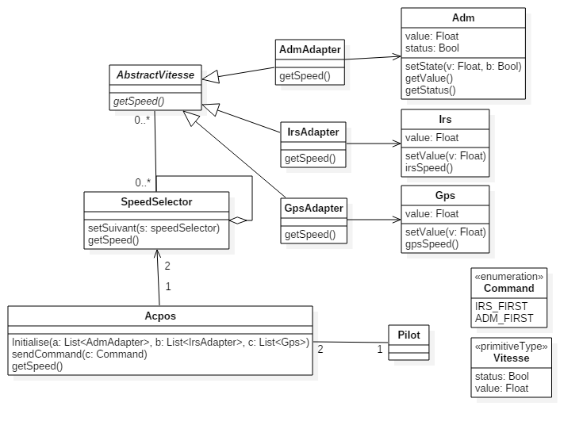

# CS 515 - TP3 : Pattern Stratégie

> Alexis BERTRAND
>
> Guillaume BRUCHON

## Diagramme UML

## Code source

## Tests

### Fonction de test

### Fichier de test

### Exécution des tests

### Analyse
